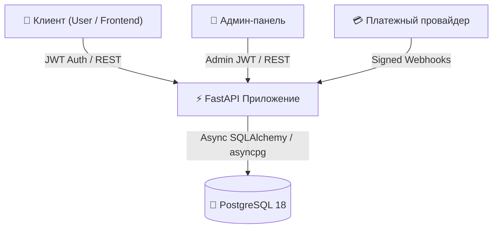
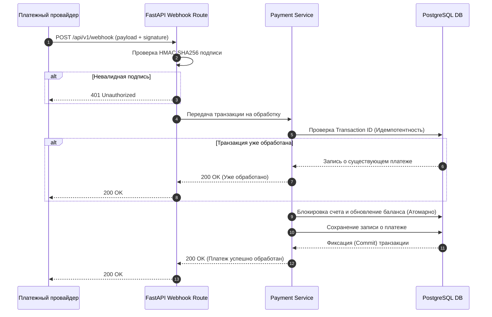

<h1 align="center">💳 Payment API</h1>

<p align="center">
  <strong>Асинхронный REST API для обработки платежей на FastAPI, PostgreSQL, с JWT-аутентификацией и идемпотентными вебуками.</strong>
</p>

<p align="center">
  <a href="https://github.com/AmaLS367/payment-api-test-task/actions/workflows/ci.yml">
    
  </a>
  
  
  
  
  
  <a href="LICENSE">
    
  </a>
</p>

---

## ✨ Возможности

- **JWT Аутентификация (Пользователи и Админы)**: Защищенная аутентификация по протоколу HTTP Bearer с ролевой моделью доступа (RBAC).
- **Счета пользователей и балансы**: Автоматическое создание счетов, просмотр списка счетов и отслеживание баланса в реальном времени.
- **История платежей**: Неизменяемый аудит транзакций с привязкой к счетам и пользователям.
- **Администрирование пользователей**: Полноценные API-эндпоинты для создания, просмотра, обновления и удаления пользователей.
- **Защищенный вебук зачислений**: Проверка HMAC-подписи (SHA256) в заголовках запросов для безопасной интеграции с платежным провайдером.
- **Идемпотентная обработка транзакций**: Гарантия однократного исполнения по уникальному `transaction_id`, предотвращающая дубли при повторных сетевых запросах.
- **Атомарное обновление баланса**: Использование транзакций на уровне БД для предотвращения состояния гонки (race conditions) при одновременных зачислениях.

---

## 🚀 Быстрый старт

### Docker Compose (Рекомендуемый способ)

Запуск PostgreSQL и API-сервиса в контейнерах. Миграции базы данных Alembic выполняются автоматически перед запуском приложения:

```bash
docker compose up --build
```

Сервер будет доступен по адресу `http://localhost:8000`. Проверить работоспособность можно через эндпоинт `/health`:

```bash
curl http://localhost:8000/health
```

### Локальный запуск через uv

1. **Установка зависимостей**:
   ```bash
   uv sync
   ```

2. **Настройка окружения**:
   ```bash
   cp .env.example .env
   ```

3. **Применение миграций базы данных**:
   ```bash
   uv run alembic upgrade head
   ```

4. **Запуск сервера разработки**:
   ```bash
   uv run uvicorn app.main:app --reload
   ```

---

## 🔑 Учетные данные по умолчанию

База данных автоматически инициализируется первичными данными при выполнении миграций Alembic:

| Роль | Email | Пароль | Начальное состояние |
| --- | --- | --- | --- |
| **Пользователь** | `user@example.com` | `user-password` | Счет ID 1 (Баланс: `0.00`) |
| **Администратор** | `admin@example.com` | `admin-password` | Полный административный доступ |

---

## 🏗️ Архитектура



---

## 💸 Поток обработки платежа



---

## 🧩 Основные эндпоинты

| Метод | Эндпоинт | Доступ | Описание |
| --- | --- | --- | --- |
| `GET` | `/health` | Публичный | Проверка статуса системы |
| `POST` | `/api/v1/auth/login` | Публичный | Аутентификация пользователя/админа и получение JWT |
| `GET` | `/api/v1/users/me` | Пользователь | Профиль текущего аутентифицированного пользователя |
| `GET` | `/api/v1/users/me/accounts` | Пользователь | Список счетов и текущие балансы |
| `GET` | `/api/v1/users/me/payments` | Пользователь | История платежей текущего пользователя |
| `GET` | `/api/v1/admin/me` | Админ | Профиль текущего администратора |
| `GET` | `/api/v1/admin/users` | Админ | Список всех зарегистрированных пользователей |
| `POST` | `/api/v1/admin/users` | Админ | Создание нового пользователя |
| `PATCH` | `/api/v1/admin/users/{id}` | Админ | Обновление данных пользователя |
| `DELETE` | `/api/v1/admin/users/{id}` | Админ | Удаление аккаунта пользователя |
| `POST` | `/api/v1/webhook` | Провайдер | Прием и обработка подписанного вебука зачисления |

Интерактивная документация Swagger UI доступна по адресу [/docs](http://localhost:8000/docs), а ReDoc — по адресу [/redoc](http://localhost:8000/redoc).

---

## 🛡️ Архитектурные и технические решения

- **Async SQLAlchemy 2.0 & asyncpg**: Полностью асинхронный неблокирующий I/O пайплайн, рассчитанный на высокие нагрузки при обработке платежей.
- **Точные типы `Decimal` и `NUMERIC(18,2)`**: Гарантируют точные финансовые расчёты на уровне приложения и базы данных, исключая ошибки вычислений с плавающей точкой IEEE 754.
- **Уникальные Transaction ID на уровне БД**: Жесткое ограничение уникальности (`ix_payments_transaction_id`) обеспечивает идемпотентность даже при параллельных повторных запросах.
- **Атомарное обновление баланса**: Зачисление средств и создание записи о платеже объединены в единую транзакцию БД, исключая частичные обновления.
- **Обработка гонок при вебуках**: Корректный перехват `IntegrityError` при одновременных дублирующих запросах вебука с переключением на получение уже существующей записи.
- **HTTP Bearer JWT Аутентификация**: Бесстеstate-авторизация с помощью токенов JWT (HMAC SHA256) и настраиваемым временем жизни.
- **Миграции Alembic**: Версионирование схемы БД и автоматический сеединг начальных данных.
- **Безопасный Docker-контейнер**: Сборка и запуск приложения под непривилегированным пользователем (non-root) в Alpine Linux.

---

## 🧪 Качество и верификация

- **59 Тестов**: Полное покрытие автотестами аутентификации, пользовательских и администраторских роутов, а также логики вебуков.
- **~99% Покрытие кода (Coverage)**: Подтвержденный уровень покрытия с учетом всех веток исполнения (`pytest-cov`).
- **Ruff & mypy Strict**: Нулевое количество замечаний линтера и соблюдение строгого режима статической типизации mypy.
- **GitHub Actions CI**: Автоматизированная непрерывная интеграция (проверка стиля, типов, запуск тестов и сборка Docker-образа при каждом пуше).
- **Docker Smoke Test**: Автоматическая проверка работоспособности сервиса в изолированном контейнерном окружении.

Команды для локальной проверки качества:

```bash
uv run pytest
uv run mypy app
uv run ruff check .
uv run ruff format --check .
```

---

## 📦 Структура проекта

```text
.
├── alembic/              # Скрипты и версии миграций базы данных
├── app/                  # Исходный код приложения
│   ├── api/              # Маршруты API и зависимости FastAPI
│   ├── core/             # Конфигурация и утилиты безопасности
│   ├── db/               # Подключение к БД и базовая модель ORM
│   ├── models/           # Модели SQLAlchemy ORM
│   ├── schemas/          # Схемы валидации и сериализации Pydantic
│   └── services/         # Сервисный слой бизнес-логики
├── tests/                # Набор автотестов и фикстур
├── compose.yaml          # Конфигурация Docker Compose
├── Dockerfile            # Многоэтапная сборка Docker-образа
└── pyproject.toml        # Зависимости и настройки инструментов
```

---

## 📄 Лицензия

Проект распространяется под лицензией MIT — подробности см. в файле [LICENSE](LICENSE).
